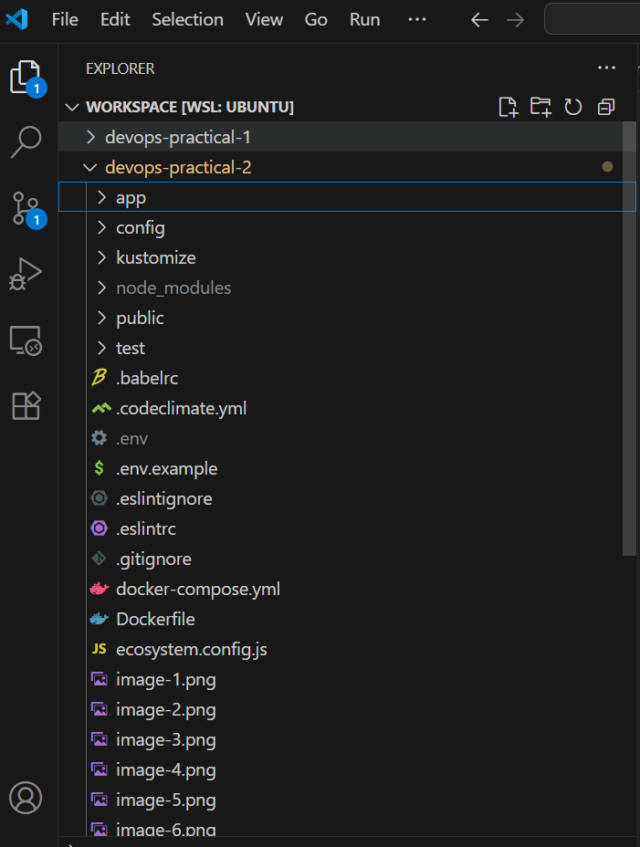

# Full-Stack Application Deployment on Kubernetes (Minikube)

This repository demonstrates how to containerize and deploy a **Node.js application** with a **MongoDB database** to a **local Kubernetes cluster using Minikube**.  

The setup includes:
- Dockerized services for Node.js and MongoDB
- Kubernetes manifests organized with **Kustomize** for environment management
- Steps to test and access the application locally through Minikube
- Instructions to verify data in MongoDB after submitting entries through the UI

## Architecture Overview:
NodeJS App <--> MongoDB
│ ▲
│ │
▼ │
Kubernetes Cluster (Minikube)
Deployment │ │ StatefulSet
(node-app) │ │ (mongo)
│ ▲
│ │
▼ │
Service
(Cluster IP/NodePort)

## Tech Stack:

| Tool/Tech      | Purpose                                     |
|----------------|---------------------------------------------|
| **Minikube**   | Local Kubernetes Cluster                    |
| **Docker**     | Containerization of Services                |
| **Kustomize**  | Base and Overlay Kubernetes Configuration   |
| **kubectl**    | Kubernetes CLI for Managing Resources       |
| **MongoDB**    | Database Backend                            |

## Step-by-Step Setup (Minikube):

### Prerequisites:
Make sure you have the following installed:
- [Docker]
- [Kubectl]
- [Minikube]

### Verify installations:
docker --version

kubectl version --client

minikube version

### Commands Used:
minikube start --driver=docker

kubectl get nodes

kubectl apply -k kustomize/base

kubectl get pods

kubectl get svc

minikube service node-app --url

kubectl exec -it mongo-55f94c9bbc-l9cr2 -- mongosh

---

# Docker Images and Containers:
1) Docker images

2) Docker containers

# Commands Inside Mongodb:
show dbs

use devopsdb

# Environment Variables:
Variable	Description
NODE_ENV	development (default)
MONGO_URI	Connection string for MongoDB

Note: This setup is for local development only.

# Repository Structure:

# Screenshots of Application UI:
1) Profile Tab

2) New Article Tab

3) Home Screen showing different entries

# Author: Venkatesh Tuniki 

"I have setup the Kubernetes cluster using **Minikube**. I attempted to work using EKS - An aws managed kubernetes cluster, however I'm experincing some issues with account registration step with AWS personal account as my previous one was closed. Hence deployed the app and mongo containers using Minikube."